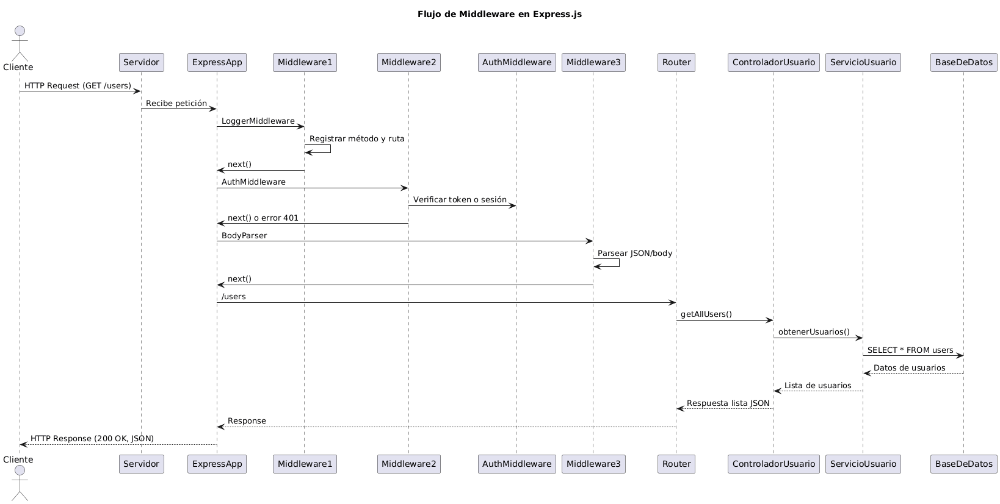

# Clase N° 9 - Creando un Servidor Web

## Temario
1. Servidor Web Node Nativo  
2. Express JS  
3. Middlewares  

---

## Objetivos de la Clase

Los objetivos de esta clase se centran en proporcionar a los estudiantes una comprensión sólida y práctica del desarrollo de servidores en entornos JavaScript, utilizando tanto Node.js nativo como el marco de trabajo Express.js.  
Se espera que al finalizar la misma, los estudiantes puedan configurar y ejecutar un servidor básico en Node.js sin depender de librerías externas, entendiendo el funcionamiento interno de las solicitudes y respuestas HTTP.  

Además, aprenderán a instalar, configurar y utilizar Express.js, explorando herramientas como **Express Generator** para agilizar la creación de proyectos. Un enfoque clave será implementar un servidor que sirva contenido desde una carpeta pública, integrando conceptos básicos de enrutamiento y gestión de recursos estáticos.  

Finalmente, se introducirá el concepto de **middlewares** en Express.js, destacando su importancia en la personalización y el manejo de flujos de datos dentro de las aplicaciones web.

---

## Servidor Web Node Nativo

### Introducción a Node.js

Node.js es un entorno de ejecución para JavaScript que permite construir aplicaciones del lado del servidor. Una de sus múltiples funcionalidades incluye la capacidad de crear servidores web utilizando módulos nativos como **http**.

### Paso a paso para crear un servidor

Una vez tengamos nuestra configuración inicial para proyectos de Node, habiendo inicializado NPM y teniendo nuestro archivo de punto de entrada llamado `index.js`, podemos comenzar a trabajar en nuestro servidor:

1. **Importar el módulo http**

```js
const http = require('http');
```

2. **Crear el servidor**

```js
const server = http.createServer((req, res) => {
  res.statusCode = 200;
  res.setHeader('Content-Type', 'text/plain');
  res.end('Hola, mundo!');
});
```

3. **Escuchar en un puerto**

```js
const PORT = 3000;
server.listen(PORT, () => {
  console.log(`Servidor corriendo en http://localhost:${PORT}`);
});
```

4. **Ejecutar el código**  
Mediante el comando:

```
node index.js
```

o si configuraste un script:

```
npm run start
```

Al ingresar a **http://localhost:3000**, podrás ver el mensaje “Hola, mundo!”.

Este servidor básico nos brinda una base para entender cómo funciona un servidor web, pero presenta limitaciones cuando intentamos ampliarlo. Por ejemplo, solo responde a la ruta `/`, no permite rutas dinámicas y carece de middlewares o gestión avanzada.

Por ello, es común utilizar frameworks como **Express.js** o **Nest.js**.

---

## Express JS

Express.js es un framework minimalista y flexible para Node.js que permite construir servidores web y APIs de forma rápida y sencilla.  

### Instalación de Express.js

```bash
npm install express
```

Agrega en tu `package.json`:

```json
"type": "module"
```

### Paso a paso para crear un servidor

```js
import express from 'express';
const app = express();

app.get('/', (req, res) => {
  res.send('Hola, mundo desde Express!');
});

const PORT = 3000;
app.listen(PORT, () => {
  console.log(`Server running at http://localhost:${PORT}`);
});
```

También podemos definir múltiples rutas:

```js
app.get('/productos', (req, res) => {
  res.send('Bienvenid@ a la página de productos');
});

app.get('/productos/14', (req, res) => {
  res.send('Estás viendo el producto N° 14.');
});
```

---

## Express Generator

**Express Generator** es una herramienta proporcionada por el equipo de Express.js que permite crear la estructura inicial de un proyecto de manera automática y estandarizada.  

### Instalación

```bash
npm install -g express-generator
```

### Crear un nuevo proyecto

```bash
express nombre-del-proyecto
cd nombre-del-proyecto
npm install
npm start
```

Este generador crea carpetas como `/routes`, `/views`, y `/public`, que estructuran el proyecto de forma clara.  

La carpeta `/public` cumple un rol especial: sirve los archivos estáticos (HTML, CSS, imágenes, JS del frontend). Es el equivalente moderno a `public_html` en servicios de hosting.

---

## Primer Servidor de Archivos Estáticos

1. **Crear la carpeta `public`:**  
   Dentro del proyecto, crea una carpeta llamada `public`.

2. **Configurar el servidor:**  

```js
import express from 'express';
import { join, dirname } from 'path';
import { fileURLToPath } from 'url';

const __filename = fileURLToPath(import.meta.url);
const __dirname = dirname(__filename);
const app = express();

app.use(express.static(join(__dirname, 'public')));

const PORT = 3000;
app.listen(PORT, () => {
  console.log(`Servidor en http://localhost:${PORT}`);
});
```

3. **Agregar contenido estático:**

```html
<!DOCTYPE html>
<html lang="en">
<head>
  <meta charset="UTF-8">
  <title>Servidor de archivos estáticos</title>
  <link rel="stylesheet" href="style.css">
</head>
<body>
  <h1>Hola desde nuestro servidor de archivos estáticos</h1>
</body>
<script src="main.js"></script>
</html>
```

4. **Ejecutar y probar**  
Al ingresar a [http://localhost:3000](http://localhost:3000) verás tu página servida desde Express.

---

## Middlewares

En la sección anterior, al usar `express.static()` dentro de `app.use()`, sin saberlo, usamos un **middleware**.

### ¿Qué es un Middleware?

Un middleware es una función que se ejecuta entre la solicitud y la respuesta. Puede modificar la request, procesar datos o incluso detener el flujo con `next()`.

### Tipos de middlewares

1. Middlewares de aplicación  
2. Middlewares de ruta  
3. Middlewares de terceros  
4. Middlewares integrados (como `express.static`)

### Ejemplo básico

```js
import express from 'express';
const app = express();

app.use((req, res, next) => {
  console.log(`Datos recibidos: ${req.method} ${req.url}`);
  next();
});

app.get('/', (req, res) => {
  res.send('Hola desde Express con middlewares!');
});

const PORT = 3000;
app.listen(PORT, () => {
  console.log(`Servidor en http://localhost:${PORT}`);
});
```

Este middleware se ejecuta antes de cada ruta, imprime los datos de la solicitud y luego permite que el flujo continúe con `next()`.

---

## Diagrama conceptual Middleware



---

## Ejercicio Práctico

### Ejercicio 1 - Configurando el Proyecto Base

> **Storytelling:**  
> Matías te observa con una sonrisa intrigada mientras sostiene una taza de café. Está contento de lo que has logrado hasta el momento y aún más por tu reciente incorporación al equipo.  
>  
> “Bueno, esto está tomando forma, pero necesitamos establecer una base sólida para nuestro proyecto integrador”, comenta mientras señala tu laptop.  
>  
> Sabrina asiente. “Crear un proyecto bien estructurado es como construir los cimientos de un edificio. Queremos que este proyecto sea el punto de partida para algo más grande.”

**Misión:**

1. Crea un nuevo proyecto con el comando `npm init -y`.  
2. Inicializa un repositorio de Git con `git init`.  
3. Crea un archivo `.gitignore` que excluya `node_modules`.  
4. Configura el `package.json` agregando `"type": "module"`.  
5. Define un script `"start": "node index.js"`.  

---

### Ejercicio 2 - Tu Primer Servidor Web

> **Storytelling:**  
> Impresionados por tu habilidad para establecer las bases del proyecto, Matías y Sabrina deciden aumentar el desafío.  
>  
> “Ahora es momento de que entres al mundo real del desarrollo web con Express,” dice Matías, colocándose frente a la pizarra.  
> “Queremos que configures un servidor básico que pueda manejar solicitudes.”  
>  
> Sabrina toma la palabra: “Recuerda, la clave está en lo simple pero funcional. Con una ruta bien configurada, demostraremos que nuestro servidor está listo para crecer.”  
>  
> Matías concluye: “Queremos ver un servidor funcional, código limpio y bien comentado. Este servidor será el corazón de nuestro proyecto integrador, así que pon tu mejor esfuerzo.”

**Misión 2:**

1. Usa la estructura creada en el ejercicio anterior para iniciar un servidor web.  
2. Instala Express con `npm install express`.  
3. Configura un servidor básico que corra en el puerto 3000 usando Express.  
4. Agrega una ruta `/ping` que responda con el texto plano “/pong”.  

---

## Materiales y Recursos Adicionales

- [Documentación oficial de Node.js](https://nodejs.org/docs)
- [Documentación de Express.js](https://expressjs.com)
- Entornos recomendados para probar APIs: **Postman** y **Insomnia**

---

## Preguntas para Reflexionar

- ¿Qué ventajas y desventajas encuentras en configurar un servidor nativo con Node.js en comparación con usar Express.js?  
- ¿Por qué es importante organizar los archivos estáticos en una carpeta como `public`, y cómo mejora esto la seguridad y accesibilidad de un servidor?  
- Al usar herramientas como Express Generator, ¿en qué casos prefieres configurar manualmente un proyecto y en cuáles optarías por su uso?  
- ¿Qué elementos considerarías al estructurar un servidor web que escale para manejar miles de usuarios simultáneamente?  

---

## Próximos Pasos

- Modelando una API Rest  
- Request y Response  
- Capa lógica: controlando la respuesta de nuestra aplicación  
